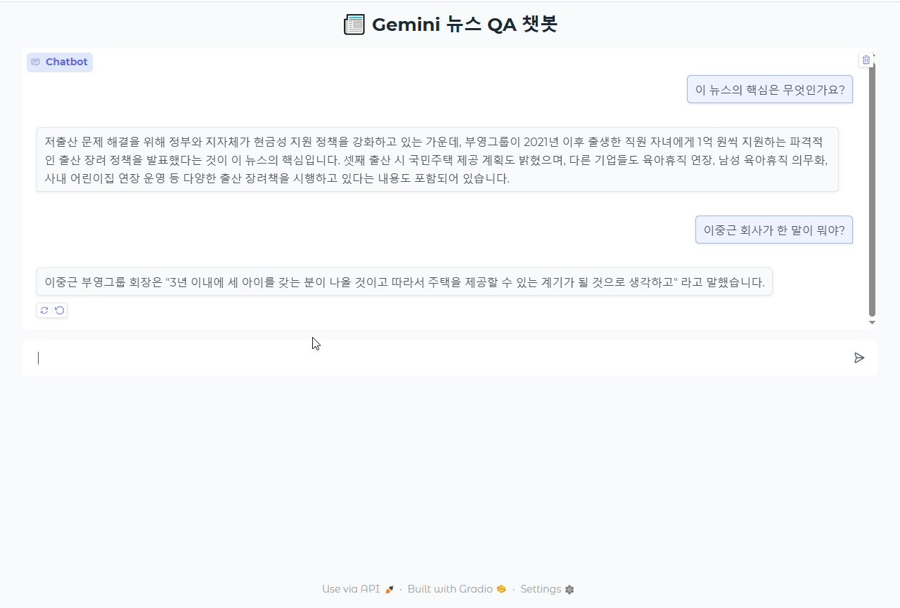

# 📰 Gemini 기반 뉴스 QA 챗봇

AI기반 사용자 중심 뉴스 요약 및 질의응답 챗봇 프로젝트입니다.  
LangChain, Gemini, FAISS 벡터 검색, Gradio UI 등을 활용하여 실제 뉴스 문서를 기반으로 정보를 요약하고 질의응답을 지원합니다.
---

## 🎯 프로젝트 목적

1. **사용자 중심 서비스 구현**
   - 사용자가 뉴스 내용을 쉽게 이해할 수 있도록 핵심 요약 및 질문 응답 제공
   - 한국어 뉴스에 특화된 자연어 처리 기능 적용
---

## 🛠️ 기술 스택

| 구분         | 사용 기술 |
|--------------|------------|
| Backend      | FastAPI, Python |
| AI 모델      | Gemini 1.5 Pro (LangChain + Google Generative AI) |
| 벡터 검색    | FAISS (with Google Embedding) |
| 문서 로더    | LangChain WebBaseLoader, BeautifulSoup |
| 프론트엔드   | Gradio (Chat Interface) |
| 기타         | .env 환경변수, LangChain Hub Prompt |

---

## ✨ 예시 질문
✅ "이 뉴스의 핵심은 무엇인가요?"

✅ "출산 관련 정책이 뭐였어요?"

✅ "지자체에서 어떤 지원을 하나요?"

---

## 📌 주요 기능 요약
✅ 실시간 웹 뉴스 문서 로드 및 분할

✅ 벡터화 후 질의 응답 최적화

✅ Gemini 기반 자연어 응답 생성

✅ Gradio UI 기반 사용자 친화형 챗봇 인터페이스
---
##  📺 프로젝트 시연 영상

